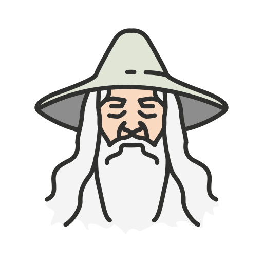

<kbd>

</kbd>

# 🧙 Gandalf Startpage 🧝

   

[繁體中文說明](doc/README.tc.md) | [日本語説明](doc/README.ja.md) 

Gandalf Startpage is a customizable startpage built with Vue 3, TypeScript, and Vite. The goal of this project is to provide users with a hackable and customizable startpage that is both easy to use and visually appealing.

## 🚀 Features

- Built with Vue 3 + TypeScript + Vite.
- Hackable content and easy customization.

## 📷 Screenshot

## 🛠️ How to Start

1. There are three environment variables that need to be set: `VITE_WEATHER_API_KEY`, `VITE_LATITUDE`, and `VITE_LONGITUDE`. Please download and enter their values in the `.env` file.
2. Type `yarn dev` in the terminal.

## ⚙️ Custom Settings

_(I'm still thinking)_

## 📝 TODO

- Complete the Docker deployment file.
- Complete the backend.

Thank you for checking out Gandalf Startpage! If you have any questions or suggestions, please feel free to open an issue or pull request on GitHub.
