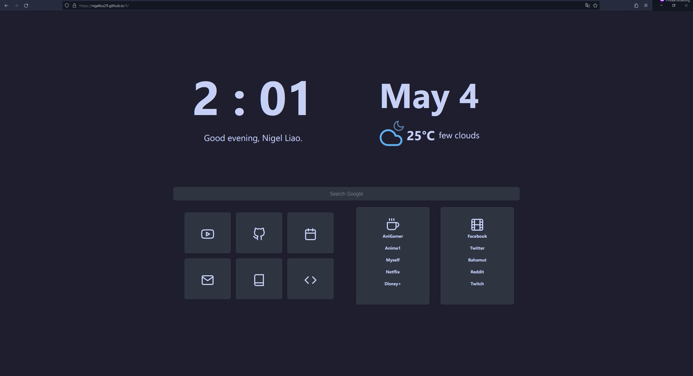

# 🧙 甘道夫啟動頁 🧝

甘道夫啟動頁是一個可自訂的啟動頁，採用 Vue 3、TypeScript 和 Vite 架構開發。這個專案的目標是為使用者提供一個可自訂且易於使用和美觀的啟動頁。

## 🚀 特色

- 採用 Vue 3、TypeScript 和 Vite 架構開發。
- 可自訂的內容和易於自訂。

## 📷 截圖

## 🛠️ 如何啟動

1. 需要設置三個環境變數：`VITE_WEATHER_API_KEY`、`VITE_LATITUDE` 和 `VITE_LONGITUDE`。請下載它們並在 `.env` 檔案中輸入它們的值。
2. 在終端中輸入 `yarn dev`。

## ⚙️ 自訂設置

（我還在思考中）

## 📝 待辦事項

- 完成 Docker 部署文件。
- 完成後端開發。

感謝您查看甘道夫啟動頁！如果您有任何問題或建議，請隨時在 GitHub 上開啟問題或拉取請求。
